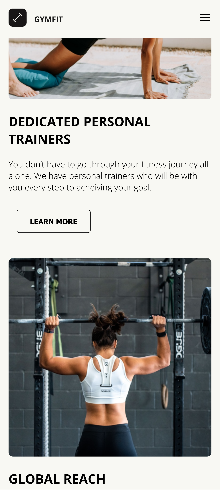

# GymFit

This is a landing page for a Gym center.

## Mobile view

 
## Desktop view

## My Process
### Built with

- Semantic HTML5 markup
- CSS custom properties
- Basic javasript

## Deploying
This project was deployed with
- [Netlify](https://www.netlify.com/)

# Links
- [Live site](https://gymfit-cypha.netlify.app/)

## Authors
### Code by:

- Github - [@OmarCypha700](https://github.com/OmarCypha700)
- Frontend Mentor - [@OmarCypha700](https://www.frontendmentor.io/profile/yourusername)
- Twitter - [@OmarCypha](https://www.twitter.com/OmarCypha)

### Design by:
Twitter - [@Daanielosas](https://twitter.com/Daanielosas?s=20&t=-0TIPeyZYPWfLKm8pElX4g)